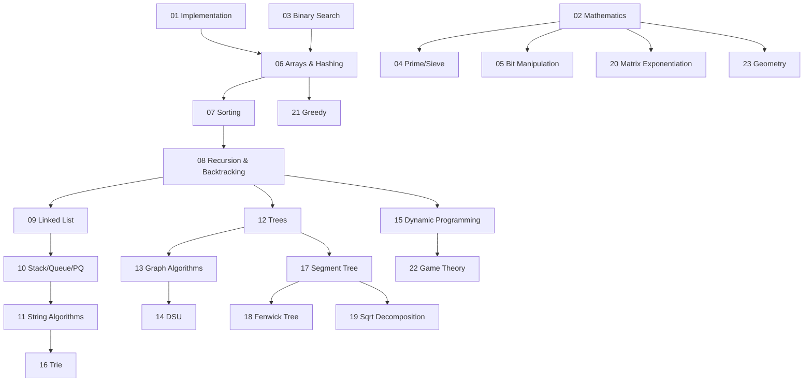

# 🧠 DSA Complete Concept Map

> Every concept, sub-concept, prerequisite, and estimated time to master — organized hierarchically.

---

## 📊 Summary

| Metric | Count |
|--------|-------|
| **Top-level Topics** | 23 |
| **Sub-topics** | 151 |
| **Curated Problems** | 688+ |
| **Difficulty Levels** | Easy → Hard |
| **Platforms** | LeetCode, Codeforces, CSES, SPOJ, GFG, AtCoder, HackerRank |

---

## 🗺️ Concept Dependency Graph

---

## 📚 Complete Topic Breakdown

---

### 01 — Implementation & Constructive ⭐ Easy → Medium
**Estimated Time:** 1-2 weeks | **Prerequisites:** Basic programming

| # | Sub-topic | Key Patterns | Problems |
|---|-----------|-------------|----------|
| 01 | Ad-Hoc | Simulation, edge cases, brute force with optimization | 6 |
| 02 | Simulation | Step-by-step process modeling, state machines | 5 |
| 03 | Greedy Construction | Build valid solutions greedily, prove correctness | 5 |

---

### 02 — Mathematics ⭐ Easy → Hard
**Estimated Time:** 2-3 weeks | **Prerequisites:** Basic math

| # | Sub-topic | Key Patterns | Problems |
|---|-----------|-------------|----------|
| 01 | Number Theory | Divisibility, parity, prime properties | 6 |
| 02 | Modular Arithmetic | Modular exponentiation, inverse, Fermat's theorem | 5 |
| 03 | Combinatorics | nCr, Pascal's triangle, stars and bars, counting | 6 |
| 04 | GCD/LCM/Euclidean | Euclidean algorithm, Bezout's identity, extended GCD | 5 |
| 05 | Euler Totient | φ(n), coprime counting, primitive roots | 5 |
| 06 | Catalan Numbers | BST count, valid parentheses, non-crossing partitions | 5 |
| 07 | Matrix Determinant | Gaussian elimination, linear systems, matrix rank | 4 |
| 08 | Probability & Expected Value | Probability DP, expected value computation | 5 |

---

### 03 — Binary Search ⭐ Easy → Medium
**Estimated Time:** 1-2 weeks | **Prerequisites:** Arrays, sorting

| # | Sub-topic | Key Patterns | Problems |
|---|-----------|-------------|----------|
| 01 | Basic Binary Search | Lower/upper bound, search in sorted array | 6 |
| 02 | Binary Search on Answer | Minimize max / maximize min, feasibility check | 6 |
| 03 | Search in Rotated Array | Identifying sorted half, pivot finding | 5 |

---

### 04 — Prime, Sieve, Factorisation ⭐⭐ Medium
**Estimated Time:** 1 week | **Prerequisites:** Mathematics

| # | Sub-topic | Key Patterns | Problems |
|---|-----------|-------------|----------|
| 01 | Sieve of Eratosthenes | Mark composites, O(n log log n) | 5 |
| 02 | Segmented Sieve | Range primes, memory-efficient sieve | 5 |
| 03 | Prime Factorisation | Trial division, smallest prime factor | 5 |

---

### 05 — Bit Manipulation ⭐⭐ Medium
**Estimated Time:** 1 week | **Prerequisites:** Binary number system

| # | Sub-topic | Key Patterns | Problems |
|---|-----------|-------------|----------|
| 01 | Basics | AND/OR/XOR, shifting, masking, Brian Kernighan | 6 |
| 02 | Power Set | Bitmask subset generation, subset enumeration | 5 |
| 03 | XOR Problems | Cancellation property, prefix XOR, trie-based | 6 |

---

### 06 — Arrays & Hashing ⭐ Easy → Medium
**Estimated Time:** 2-3 weeks | **Prerequisites:** Basic programming

| # | Sub-topic | Key Patterns | Problems |
|---|-----------|-------------|----------|
| 01 | Two Pointer | Converging pointers, same-direction pointers | 6 |
| 02 | Sliding Window | Fixed/variable window, frequency tracking | 6 |
| 03 | Prefix Sum | 1D/2D prefix sum, difference array | 6 |
| 04 | Kadane's Algorithm | Maximum subarray, circular variant, product variant | 5 |
| 05 | Hashing / HashMap | Frequency counting, two-sum pattern, grouping | 6 |
| 06 | Dutch National Flag | 3-way partition, sort colors | 5 |
| 07 | Merge Intervals | Sort by start, sweep line, interval intersection | 6 |
| 08 | Matrix Traversal | Spiral, diagonal, rotation, boundary walking | 5 |

---

### 07 — Sorting & Searching ⭐ Easy → Medium
**Estimated Time:** 2 weeks | **Prerequisites:** Arrays

| # | Sub-topic | Key Patterns | Problems |
|---|-----------|-------------|----------|
| 01 | Merge Sort | Divide & conquer, inversion count | 5 |
| 02 | Quick Sort | Partition, quick select, randomized pivot | 5 |
| 03 | Counting Sort | Small value range, frequency-based | 5 |
| 04 | Heap Sort | In-place via max-heap, heapify | 5 |
| 05 | Radix Sort | Digit-by-digit, LSD/MSD | 4 |
| 06 | Bucket Sort | Range distribution, frequency buckets | 4 |
| 07 | Custom Comparators | Multi-key sorting, lambda comparators | 5 |

---

### 08 — Recursion & Backtracking ⭐⭐ Medium → Hard
**Estimated Time:** 3-4 weeks | **Prerequisites:** Recursion basics

| # | Sub-topic | Key Patterns | Problems |
|---|-----------|-------------|----------|
| 01 | Recursion Basics | Base case, recursive step, tree of calls | 5 |
| 02 | Subsets & Combinations | Include/exclude, dedup, combination sum | 6 |
| 03 | Permutations | Swap-based, used-array, next permutation | 5 |
| 04 | N-Queens | Row-by-row placement, column/diagonal tracking | 4 |
| 05 | Sudoku Solver | Constraint propagation, backtrack on failure | 4 |
| 06 | Divide and Conquer | Split → solve → merge, master theorem | 5 |
| 07 | Rat in Maze | Grid backtracking, path finding | 4 |
| 08 | Word Search | 2D grid word matching, trie optimization | 4 |
| 09 | Expression Parsing | Recursive descent, operator precedence | 5 |

---

### 09 — Linked List ⭐ Easy → Medium
**Estimated Time:** 1-2 weeks | **Prerequisites:** Pointers/references

| # | Sub-topic | Key Patterns | Problems |
|---|-----------|-------------|----------|
| 01 | Singly Linked List | Reverse, middle, remove nth, intersection | 6 |
| 02 | Doubly Linked List | DLL design, LRU cache, browser history | 5 |
| 03 | Cycle Detection | Floyd's algorithm, cycle start, implicit graph | 4 |
| 04 | Merge/Sort Lists | Merge k lists, sort list, partition | 5 |
| 05 | Flatten Linked List | Multilevel flattening, tree → list | 4 |
| 06 | LRU Cache | HashMap + DLL for O(1), LFU extension | 4 |
| 07 | Reverse in Groups | Reverse k-group, swap pairs, partial reverse | 4 |

---

### 10 — Stack, Queue, Priority Queue ⭐⭐ Medium
**Estimated Time:** 2-3 weeks | **Prerequisites:** Arrays, linked lists

| # | Sub-topic | Key Patterns | Problems |
|---|-----------|-------------|----------|
| 01 | Stack Problems | Bracket matching, decode string, min stack | 6 |
| 02 | Monotonic Stack | Next greater element, histogram, contribution | 6 |
| 03 | Queue Problems | Queue using stacks, circular queue | 5 |
| 04 | Priority Queue / Heap | Kth element, median stream, merge k lists | 6 |
| 05 | Deque Problems | Sliding window max, monotonic deque | 4 |
| 06 | Circular Queue | Ring buffer, modular arithmetic | 4 |
| 07 | Next Greater Element | NGE I/II/III, linked list, temperatures | 5 |
| 08 | Stock Span | Online stock span, buy/sell stock variants | 4 |

---

### 11 — String Algorithms ⭐⭐⭐ Hard
**Estimated Time:** 3-4 weeks | **Prerequisites:** Arrays, hashing

| # | Sub-topic | Key Patterns | Problems |
|---|-----------|-------------|----------|
| 01 | KMP Algorithm | Failure function, pattern matching, prefix = suffix | 5 |
| 02 | Rabin-Karp | Rolling hash, substring matching, duplicate detection | 4 |
| 03 | Z-Algorithm | Z-array, alternative to KMP | 4 |
| 04 | Manacher's Algorithm | Longest palindromic substring in O(n) | 4 |
| 05 | Suffix Array | SA construction, LCP array, distinct substrings | 4 |
| 06 | String Hashing | Polynomial hash, rolling hash, anagram grouping | 5 |
| 07 | Palindrome Partitioning | Min cuts, k-palindromes, backtracking | 4 |
| 08 | Aho-Corasick | Multi-pattern matching, automaton + DP | 4 |

---

### 12 — Trees ⭐⭐ Medium → Hard
**Estimated Time:** 3-4 weeks | **Prerequisites:** Recursion, queues

| # | Sub-topic | Key Patterns | Problems |
|---|-----------|-------------|----------|
| 01 | Binary Tree Traversals | Inorder/preorder/postorder, level order, vertical | 6 |
| 02 | BST | Validate, kth smallest, delete, convert sorted array | 5 |
| 03 | LCA | Recursive LCA, binary lifting, distance queries | 5 |
| 04 | Tree DP | Diameter, max path sum, rerooting technique | 6 |
| 05 | Euler Tour | Flatten tree to array, subtree queries | 4 |
| 06 | Heavy-Light Decomposition | Chain decomposition, path queries with seg tree | 4 |
| 07 | Morris Traversal | O(1) space traversal via threading | 4 |
| 08 | Centroid Decomposition | Centroid tree, path queries, divide & conquer on tree | 4 |

---

### 13 — Graph Algorithms ⭐⭐⭐ Hard
**Estimated Time:** 4-6 weeks | **Prerequisites:** Trees, queues, recursion

| # | Sub-topic | Key Patterns | Problems |
|---|-----------|-------------|----------|
| 01 | BFS/DFS | Grid traversal, connected components, flood fill | 6 |
| 02 | Topological Sort | Kahn's algorithm, DAG ordering | 5 |
| 03 | Dijkstra | Priority queue SSSP, modified variants | 5 |
| 04 | Bellman-Ford | Negative weights, negative cycle detection | 4 |
| 05 | Floyd-Warshall | All-pairs shortest path, transitive closure | 4 |
| 06 | MST (Kruskal/Prim) | Minimum spanning tree, DSU-based | 5 |
| 07 | Strongly Connected Components | Kosaraju, Tarjan, condensation graph | 4 |
| 08 | Bridges & Articulation Points | Tarjan's low-link, biconnected components | 4 |
| 09 | Graph + DP | DP on DAG, shortest path counting, state-space | 4 |
| 10 | Network Flow | Ford-Fulkerson, Edmonds-Karp, max-flow min-cut | 4 |
| 11 | Bipartite Graph | 2-coloring, bipartite matching | 4 |
| 12 | Euler Path/Circuit | Hierholzer's algorithm, degree conditions | 4 |
| 13 | 2-SAT | Implication graph, SCC-based satisfiability | 3 |
| 14 | Centroid Decomposition (Graph) | Tree path queries, nearest painted node | 3 |

---

### 14 — Disjoint Set Union ⭐⭐ Medium
**Estimated Time:** 1-2 weeks | **Prerequisites:** Trees, graphs basics

| # | Sub-topic | Key Patterns | Problems |
|---|-----------|-------------|----------|
| 01 | Union-Find | Component counting, cycle detection, connectivity | 5 |
| 02 | Path Compression | Amortized O(α(n)), flat tree optimization | 4 |
| 03 | DSU Problems | Making large island, stone removal, regions | 4 |
| 04 | Union by Rank | Balanced tree height, Kruskal's MST | 4 |
| 05 | Weighted DSU | Edge weights, ratio tracking, potential DSU | 3 |
| 06 | Offline Queries with DSU | Sort + union for offline answers, rollback DSU | 3 |

---

### 15 — Dynamic Programming ⭐⭐⭐ Hard
**Estimated Time:** 6-8 weeks | **Prerequisites:** Recursion, memoization

| # | Sub-topic | Key Patterns | Problems |
|---|-----------|-------------|----------|
| 01 | 1D DP | Fibonacci-like, house robber, coin change | 6 |
| 02 | 2D DP | Grid paths, maximal square, interleaving | 5 |
| 03 | DP on Strings | LCS, edit distance, wildcards, regex | 6 |
| 04 | DP on Subsequences | LIS, Russian dolls, pair chains | 5 |
| 05 | DP on Grids | Paths with obstacles, cherry pickup, maximal rectangle | 5 |
| 06 | Knapsack Variants | 0/1, unbounded, 2D knapsack, subset sum | 6 |
| 07 | DP with Bitmask | TSP, partition to K subsets, profile DP | 5 |
| 08 | Digit DP | Count numbers with digit constraints | 5 |
| 09 | DP on Trees | Diameter, max path sum, rerooting, tree matching | 5 |
| 10 | Interval DP | Burst balloons, strange printer, polygon triangulation | 5 |
| 11 | LIS Variants | LIS, longest string chain, envelope nesting | 5 |
| 12 | Matrix Chain Multiplication | Optimal BST, boolean parenthesization | 4 |
| 13 | Monotone Queue DP | Sliding window optimization, jump game VI | 5 |
| 14 | Convex Hull Trick | Line container, Li Chao tree, DP optimization | 4 |
| 15 | SOS DP (Sum over Subsets) | Submask enumeration in O(n·2^n) | 4 |
| 16 | Broken Profile DP | Domino tiling, row-by-row bitmask | 4 |
| 17 | Probability DP | Knight probability, dice games, expected value | 5 |

---

### 16 — Trie ⭐⭐ Medium → Hard
**Estimated Time:** 1-2 weeks | **Prerequisites:** Trees, strings

| # | Sub-topic | Key Patterns | Problems |
|---|-----------|-------------|----------|
| 01 | Standard Trie | Insert/search/prefix, wildcard search | 5 |
| 02 | XOR Trie | Binary trie for max XOR queries | 4 |
| 03 | Trie Problems | Longest word, stream matching, palindrome pairs | 4 |
| 04 | Autocomplete Trie | Search suggestions, design autocomplete | 4 |
| 05 | Persistent Trie | Versioned queries, XOR subarray max | 3 |

---

### 17 — Segment Tree ⭐⭐⭐ Hard
**Estimated Time:** 3-4 weeks | **Prerequisites:** Trees, recursion, divide & conquer

| # | Sub-topic | Key Patterns | Problems |
|---|-----------|-------------|----------|
| 01 | Basic Segment Tree | Point update, range query (sum/min/max) | 5 |
| 02 | Lazy Propagation | Range update, range query | 4 |
| 03 | Persistent Segment Tree | Versioned range queries, kth smallest in range | 3 |
| 04 | Merge Sort Tree | Sorted lists in nodes, order statistics | 3 |
| 05 | Iterative Segment Tree | Bottom-up, cache-friendly, simpler code | 3 |
| 06 | 2D Segment Tree | Tree of trees, 2D range queries | 3 |

---

### 18 — Fenwick Tree (BIT) ⭐⭐⭐ Hard
**Estimated Time:** 1-2 weeks | **Prerequisites:** Prefix sums, binary representation

| # | Sub-topic | Key Patterns | Problems |
|---|-----------|-------------|----------|
| 01 | Basic BIT | Point update + prefix query, inversion count | 5 |
| 02 | 2D BIT | 2D prefix sums with updates | 3 |
| 03 | BIT Problems | Inversion count, list removals, nested ranges | 4 |

---

### 19 — Sqrt Decomposition / MO's ⭐⭐⭐ Hard
**Estimated Time:** 2 weeks | **Prerequisites:** Arrays, sorting

| # | Sub-topic | Key Patterns | Problems |
|---|-----------|-------------|----------|
| 01 | Sqrt Decomposition | Block-based range queries, √n blocks | 4 |
| 02 | MO's Algorithm | Offline query processing, add/remove elements | 4 |
| 03 | MO's on Trees | Euler Tour + MO's for tree path queries | 3 |
| 04 | Block Decomposition | Range updates with blocks, baby-step giant-step | 3 |

---

### 20 — Matrix Exponentiation ⭐⭐⭐ Hard
**Estimated Time:** 1-2 weeks | **Prerequisites:** Matrices, recursion, DP

| # | Sub-topic | Key Patterns | Problems |
|---|-----------|-------------|----------|
| 01 | Linear Recurrence | Fibonacci in O(log n), general k-term recurrence | 5 |
| 02 | Fibonacci Variants | Sum of Fibonacci, Pisano period, subsequences | 4 |
| 03 | Graph Powers | Path counting, shortest k-edge path | 3 |

---

### 21 — Greedy Algorithms ⭐⭐ Medium
**Estimated Time:** 2-3 weeks | **Prerequisites:** Sorting, basic math

| # | Sub-topic | Key Patterns | Problems |
|---|-----------|-------------|----------|
| 01 | Activity Selection | Sort by end time, maximum non-overlapping | 4 |
| 02 | Interval Scheduling | Min rooms, sweep line, event processing | 4 |
| 03 | Huffman Coding | Merge smallest first, priority queue | 4 |
| 04 | Fractional Knapsack | Value/weight ratio, greedy selection | 4 |
| 05 | Job Scheduling | Deadline-based, profit maximization | 4 |
| 06 | Minimum Platforms | Event-based sweep line | 4 |
| 07 | Gas Station | Surplus tracking, circular greedy | 5 |

---

### 22 — Game Theory ⭐⭐⭐ Hard
**Estimated Time:** 2 weeks | **Prerequisites:** DP, recursion, math

| # | Sub-topic | Key Patterns | Problems |
|---|-----------|-------------|----------|
| 01 | Nim Game | XOR of piles, parity tricks | 5 |
| 02 | Sprague-Grundy | Grundy numbers, game decomposition | 4 |
| 03 | Combinatorial Games | Bitmask state search, can-first-player-win | 4 |
| 04 | Minimax | Optimal play, alpha-beta pruning | 4 |
| 05 | Alpha-Beta Pruning | Pruning minimax tree for real game AI | 3 |

---

### 23 — Geometry ⭐⭐⭐ Hard
**Estimated Time:** 2-3 weeks | **Prerequisites:** Math, sorting

| # | Sub-topic | Key Patterns | Problems |
|---|-----------|-------------|----------|
| 01 | Convex Hull | Graham scan, Andrew's monotone chain | 4 |
| 02 | Line Intersection | Cross product, segment intersection | 4 |
| 03 | Sweep Line | Event processing, active set, skyline | 5 |
| 04 | Closest Pair | Divide & conquer O(n log n) | 3 |
| 05 | Point in Polygon | Ray casting, winding number | 4 |
| 06 | Polygon Area | Shoelace formula, cross product | 4 |

---

## 🎯 Recommended Study Plan

### Phase 1: Foundation (4-6 weeks)
1. 01 - Implementation & Constructive
2. 06 - Arrays & Hashing (Two Pointer, Sliding Window, Prefix Sum, Kadane's, Hashing)
3. 07 - Sorting & Searching
4. 03 - Binary Search
5. 08 - Recursion & Backtracking (Basics, Subsets, Permutations)

### Phase 2: Core Data Structures (4-6 weeks)
6. 09 - Linked List
7. 10 - Stack, Queue, Priority Queue
8. 12 - Trees (Traversals, BST, LCA)
9. 13 - Graph Algorithms (BFS, DFS, Topological Sort, Dijkstra)
10. 14 - Disjoint Set Union

### Phase 3: Dynamic Programming (6-8 weeks)
11. 15 - DP (1D → 2D → Strings → Subsequences → Grids → Knapsack)
12. 21 - Greedy Algorithms

### Phase 4: Advanced Algorithms (4-6 weeks)
13. 02 - Mathematics (Number Theory, Modular, Combinatorics)
14. 04 - Prime, Sieve, Factorisation
15. 05 - Bit Manipulation
16. 11 - String Algorithms (KMP, Z-algo, Rabin-Karp)
17. 16 - Trie

### Phase 5: Expert Topics (4-6 weeks)
18. 17 - Segment Tree (Basic → Lazy → Persistent)
19. 18 - Fenwick Tree
20. 15 - DP Advanced (Bitmask, Digit, Interval, MCM, CHT, SOS)
21. 12 - Trees Advanced (Euler Tour, HLD, Centroid Decomp)
22. 13 - Graphs Advanced (SCC, Bridges, Flow, 2-SAT)

### Phase 6: Competitive Programming (2-4 weeks)
23. 19 - Sqrt Decomposition / MO's
24. 20 - Matrix Exponentiation
25. 22 - Game Theory
26. 23 - Geometry

---

## 🔑 Pattern Recognition Guide

| If you see... | Think about... |
|---------------|----------------|
| "Sorted array" | Binary Search |
| "Subarray/substring" | Sliding Window, Prefix Sum |
| "All subsets/combinations" | Backtracking, Bitmask |
| "Shortest path" | BFS (unweighted), Dijkstra (weighted) |
| "Connected components" | DFS/BFS, DSU |
| "Optimal substructure" | DP |
| "Greedy choice property" | Greedy |
| "Range query + update" | Segment Tree, BIT |
| "Offline range queries" | MO's Algorithm |
| "Multiple pattern matching" | Aho-Corasick |
| "Maximum XOR" | Trie (binary) |
| "Game: who wins?" | Sprague-Grundy, Minimax |
| "Count ways mod M" | DP + Modular Arithmetic |
| "Large N (10^18)" | Matrix Exponentiation, Binary Search |
| "Tree path queries" | LCA, HLD, Euler Tour |
| "Cycle in graph" | DFS (directed), DSU (undirected) |
| "Interval overlap" | Sorting + Sweep Line |
| "K closest/largest/smallest" | Heap, Quick Select |

---

*Generated on: June 6, 2026 | Total: 23 topics, 151 sub-topics, 688+ curated problems*
